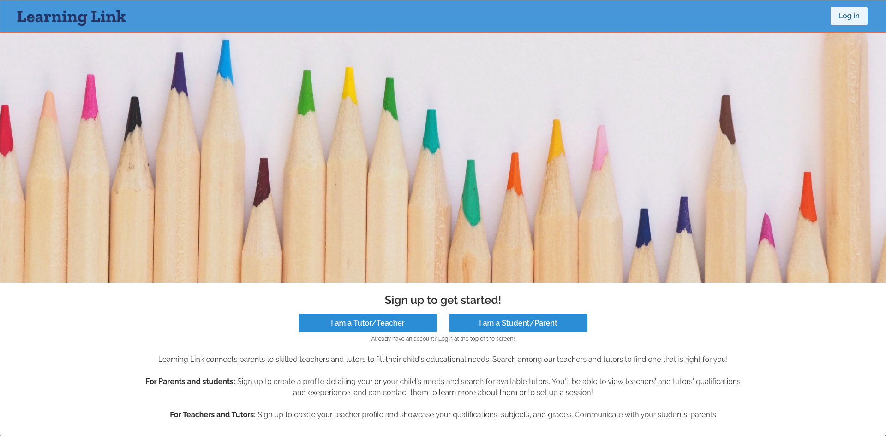

# Learning Link

 Learning Link is meant to make it easy for students and their parents to find a tutor to help support their learning.  There are two user roles, student and tutor.  Students can search for tutors that meet their needs, add them to their dashboard, send messages through the app and, and schedule tutoring sessions through the calendar.

 ## Technologies Used

 * React
 * MySQL
 * Express
 * Node
 * Axios
 * Socket.io
 * Sequelize
 * Passport
 * FullCalendar.io
 * Bulma

## Features

### Messaging

Using Socket.io, users can instant message each other.

### Search for a Tutor

Use one or multiple parameters to search for a tutor that is appropriate for your needs.

### Book a Tutoring Session

Use FullCalendar.io to book a tutoring session with your tutor.

## Test the App

### Test login with a tutor view:
* Email: bob@email.com
* Password: bob

### Test login with a student view:	
* Email: ben@email.com
* Password: ben

## Links

* [Depolyed App on Heroku](https://ancient-brushlands-96177.herokuapp.com/)
* [GitHub Repository](https://github.com/karenastell/learning-link)

## Created by:

* [Kaleigh Spurio](https://github.com/Kaleighspurio/)
* [Karen Astell](https://github.com/karenastell/)

